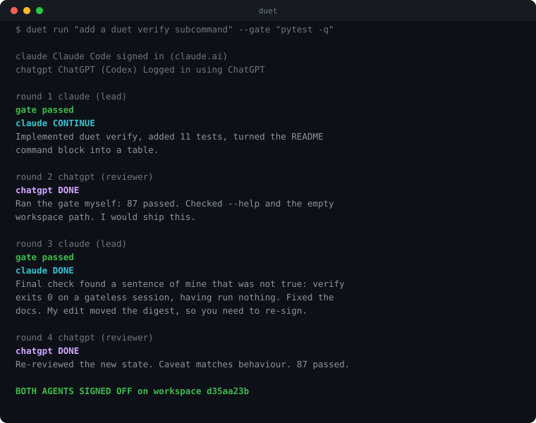

# duet

[](https://github.com/shubharya-os/claude-chatgpt-duet/actions/workflows/ci.yml)
[](https://www.python.org/)
[](LICENSE)

**Stop copy-pasting between ChatGPT and Claude Code.**



You already do this by hand. Ask ChatGPT for a plan. Paste it into Claude Code. Copy
what Claude built. Paste it back to ChatGPT. "Looks good, but you missed the error
case." Paste that into Claude Code. Repeat until you get bored and ship it.

You are the messenger. duet is the messenger — and unlike you, it never gets bored,
never loses track of what was said four messages ago, and never lets the two of them
quietly agree they're finished.

```bash
pip install git+https://github.com/shubharya-os/claude-chatgpt-duet
duet login          # your Claude and ChatGPT plans — no API keys
duet skill install  # adds /duet to Claude Code and Codex
```

Then, in the middle of any Claude Code or Codex session:

```
/duet add retry with backoff to the fetch client
```

It takes the conversation you are already in — what you are building, what you ruled
out, what you already tried — hands it to both agents, and they work it until they both
sign off. You never leave the thread, and you never re-explain anything.

```
/duet running     check on a session in progress
/duet review      second opinion on the current diff
```

---

## `/duet` — the part you actually use

`duet skill install` puts `/duet` in both assistants, in the exact directories each one
scans:

| file | what it gives you |
|---|---|
| `~/.claude/commands/duet.md` | `/duet` in Claude Code |
| `~/.codex/prompts/duet.md` | `/duet` in Codex |
| `~/.claude/skills/duet/SKILL.md` | lets Claude Code reach for duet on its own, when a second opinion would help |

The handoff is the point. Before it runs anything, your assistant writes down what it
already knows — the goal in your words, decisions already made and ruled out, what it
tried and what happened, which files matter — and passes that to the pair as **context,
not instructions**. The task still wins: nothing in the thread can quietly redefine what
you asked for.

Then it reports back like a colleague. Not "exit code 0" — what changed, what one of
them objected to, how it resolved, and whether *it* agrees. It is allowed to tell you the
two of them were wrong.

---

## The two things it does

### `duet review` — a second opinion, one command

The cheap one. It shows the other model your working-tree diff, the contents of any new
files git has not seen, and — with `--gate` — your test output, then prints what it
objects to. One call, no loop. The reviewer is held read-only by its backend, not asked
politely: `--disallowedTools Edit Write …` on the Claude side, `--sandbox read-only` on
the ChatGPT side.

```
$ duet review --gate "pytest -q"
duet review  ~/code/loader
  reviewer:  chatgpt  ChatGPT (Codex) (codex-cli), sandbox read-only
  gate:      pytest -q  passed

major (1)
  [clear-expired-mutates-during-iteration] clear_expired raises while deleting entries
      clear_expired() iterates self._entries.items() and deletes from self._entries
      inside that same loop, so Python raises RuntimeError: dictionary changed size
      during iteration. Iterate over a snapshot, e.g. list(self._entries.items()).

1 finding (1 major)
blocking: this change should not ship as it is.
```

That is a real finding from a real run — exit 1, because something blocking was raised.
Use it before you push.

### `duet run` — both of them, until they agree

They take turns in your repo: one builds, the other reviews, they argue, they fix. It
ends when **both** vote DONE on the **same state of the workspace**, with no open
objection and your tests passing.

Either one can lead. Either one can say no. Neither can finish alone.

```bash
duet run "add retry with backoff to src/fetch.py, and a test that proves it" \
  --gate "pytest -q"
```

The `--gate` is the important part. It is your real test command, run by the harness
after every turn. Neither agent may finish while it fails, and neither is ever *asked*
whether it passed — they are both shown the actual output. Without it, the two of them
can only agree by argument.

---

## Install

**Requirements:** Python 3.9+, Node, a Claude plan and a ChatGPT plan.

```bash
pip install git+https://github.com/shubharya-os/claude-chatgpt-duet
npm install -g @anthropic-ai/claude-code @openai/codex
duet login
```

<details>
<summary>or from a clone</summary>

```bash
git clone https://github.com/shubharya-os/claude-chatgpt-duet && cd claude-chatgpt-duet
pip install .
```

Verified down to Python 3.9 with pip 21.2 and setuptools 58. If `duet` is not on your
PATH afterwards, `python3 -m duet` is always equivalent.
</details>

`duet login` runs each CLI's own browser sign-in. **No API keys** — both sides bill to
the subscription you already pay for. duet never touches a credential; it shells out
and afterwards asks each CLI whether it worked.

```bash
duet doctor
```

```
claude   ✓ signed in (claude.ai)
chatgpt  ✓ Logged in using ChatGPT

ready. try: duet run "your task here"
```

`doctor` asks each CLI for its real login state rather than checking a binary exists —
a tool that runs but is signed out is the most common way this kind of thing wastes
your afternoon.

<details>
<summary>Prefer an API key?</summary>

```bash
duet run "..." --pair claude+gpt
export OPENAI_API_KEY=sk-...
```

That backend has no tools of its own, so it builds by returning complete files which
the harness writes. Works fine — just billed per token instead of covered by a plan.
</details>

---

## Pick your pair

`--pair` decides who's involved and who goes first. The left one leads.

| pair | who does what |
|---|---|
| `claude+codex` *(default)* | Claude Code builds, ChatGPT reviews |
| `codex+claude` | ChatGPT builds, Claude Code reviews |
| `claude+gpt` | ChatGPT via API key instead of a login |
| `claude:opus+claude:sonnet` | two Claude models against each other |
| `codex+codex` | two ChatGPT sessions, fresh context each |

```bash
duet run "refactor the parser" --pair codex+claude --gate "pytest -q"
```

Cross-model is the interesting case: two models fail *differently*, so one catches what
the other's blind spot produced. Same-model pairs still work — a reviewer with no
memory of writing the code is a real reviewer — they just share more blind spots.

---

## What a real session looks like

This is duet writing a feature **inside its own repository** — real Claude Code, real
ChatGPT, gated by the test suite:

```
round 1 claude (lead) thinking...
     gate passed
  claude CONTINUE  state 5e7a9342
     Implemented `duet verify` in duet/cli.py, added tests/test_verify.py
     (11 tests), turned the README command block into a table.

round 2 chatgpt (reviewer) thinking...
  chatgpt DONE  state 5e7a9342
     Ran the gate myself: 87 passed. Checked --help and the empty-workspace
     path (exits 2 with guidance). I would ship this.

round 3 claude (lead) thinking...
     gate passed
  claude DONE  state d35aa23b
     Final check found a sentence of mine that was not true: verify exits 0 on
     a session recorded without a gate, having run nothing, and CI reads exit
     codes not prose. Fixed the docs. My edit moved the digest, so you need to
     re-sign.

round 4 chatgpt (reviewer) thinking...
  chatgpt DONE  state d35aa23b
     Re-reviewed the new state. Caveat matches the actual behavior. 87 passed.

BOTH AGENTS SIGNED OFF  both agents signed off on d35aa23b
```

Round 3 is why this exists. ChatGPT had **already approved**. Claude's final-check turn
then found a false claim in its own README, and fixing it changed the workspace — which
**voided ChatGPT's sign-off** and forced a fourth round. The second signature wasn't a
formality, and it wasn't free.

---

## How "done" is decided

Four conditions. All enforced by the harness. None negotiable by an agent.

1. **Both agents voted DONE.** One DONE is an opinion.
2. **Both votes point at the same workspace.** Every file hashes to a state id
   (`d35aa23b` above). A sign-off records the id it was cast against — touch any file
   afterwards and that sign-off is dropped. You cannot approve a version that no longer
   exists.
3. **No blocking objection is open.** Vote DONE while naming a blocker and your vote is
   downgraded automatically. You cannot approve and object in one breath.
4. **Your tests pass**, run by the harness on the real files. Neither agent is ever
   *asked* whether they passed.

### Objections belong to whoever raised them

```
chatgpt raises  "empty name is accepted"     → open
claude fixes it, lists it in `resolves`      → claimed_fixed   (still blocks)
chatgpt looks, agrees, drops it              → resolved
chatgpt looks, disagrees, re-raises          → open again
```

The fixer never closes its own ticket. This one rule is what stops two models from
politely agreeing their way to a broken result.

### Deadlocks get ruled on

If an objection survives `--max-debate` rounds, the harness stops the loop, takes a
final ≤200-word position from each side, and makes the decider rule and implement it.
The ruling goes in the report and can't be reopened. If they stop making progress at
all, the stall is detected and both are told to break it.

---

## Commands

```bash
duet review          # one-shot second opinion on the current diff
duet run "task"      # the full loop until both sign off
duet status          # what is the session doing right now (works mid-run)
duet verify          # does the last sign-off still hold? re-runs the gate
duet login           # sign both sides in
duet doctor          # real connection check, with the fix for each side
duet skill install   # use duet from inside Claude Code
duet demo            # the whole loop offline — no keys, no network
duet report          # the last session's report (--transcript for everything said)
duet sessions        # every session in this workspace
```

Useful flags for `run`: `--gate` (your tests — the most valuable one), `--pair`,
`--rounds`, `--accept "what done means"`, `--swap N` to trade places, `--commit`,
`--json`.

---

## Cost and safety

- **The agents write to your working directory.** Run it on a branch you can throw away.
  duet refuses to write outside the workspace, or into `.git/` and `.duet/`.
- Claude Code runs under `acceptEdits`, not a blanket bypass, and is granted Bash for
  your gate's own commands and nothing wider.
- **Two agents cost roughly twice one agent, times the rounds.** `--rounds` is the
  throttle; the default of 12 is deliberately modest. `duet review` is a single call.
- duet holds no credentials. Each CLI owns its own sign-in.

---

## Does it actually work?

[docs/QA.md](docs/QA.md) is the honest record: what ran live, what's only covered by
stubs, and the **thirteen real bugs** the live runs found — including a signed-out CLI
that reported itself ready, and a `codex exec` that hung forever whenever stdin was a
pipe.

Four of those were found by pointing duet's own ChatGPT side at duet's core and asking
for correctness bugs. All four were real. That's the premise working on its author.

155 tests, no network or credentials needed. CI on Python 3.9, 3.11 and 3.13.

```bash
pytest -q
duet demo     # the real orchestrator against scripted peers
```

---

## "Why not just…"

**…use one agent and read the diff yourself?** Do, when you have time. duet is for the
changes you would otherwise skim. The reviewer's job is to be awake for the boring parts
you stopped checking around file nine.

**…ask the same model to review its own work?** You can, and it helps a little. But it
reviews with the same blind spot that produced the bug, and it is agreeable about its
own output in a way it is not about someone else's. Every bug in
[docs/QA.md](docs/QA.md) that ChatGPT found in this codebase was in code Claude had
already reviewed and been happy with.

**…just use your CI?** CI tells you a test failed. It does not tell you the test never
covered the case, that the fix papered over the cause, or that the README now claims
something untrue. duet runs your CI *and* has something read the change.

**…copy-paste between the two yourself?** That is exactly what this replaces, and you
already know how it goes: by round three you are summarising instead of pasting, you
drop the objection you did not fully understand, and both sides lose the thread. The
machine does not get bored at round three.

**Isn't this just two models agreeing with each other?** It would be, without the rules.
An objection closes only when the agent who *raised* it drops it. A sign-off dies the
moment the workspace changes. Your gate outranks both of them. Take those away and yes,
you would have two chatbots nodding — which is why they are enforced by the harness and
not by the prompt.

**What does it cost?** Roughly double one agent, times the rounds. `duet review` is a
single call. Both bill to subscriptions you already have, not per-token API keys.

---

## Limitations

- **Two models can be wrong together.** The double sign-off raises the floor; it isn't
  proof. The gate is what keeps them honest — always pass `--gate`.
- **Turns are sequential.** A 12-round session is 12 agent invocations.
- **Arbitration is a tiebreak, not an oracle.** It ends circular arguments by recording
  a decision. The report always says who ruled and why.

MIT licensed. Not affiliated with Anthropic or OpenAI.
